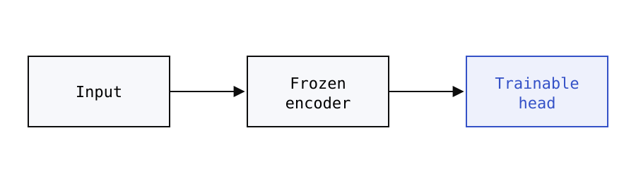

---
# SAMPLE PROJECT — shows every supported feature. Copy the folder structure,
# then replace or delete this project.
title: "Example Research Project"
subtitle: "A sample page demonstrating math, figures, tables and code"
date: "2026-09"
authors:
  - "Ziren Jin"
  - "Collaborator Name"
venue: "Venue or Workshop 2026"
status: "In progress"
summary: "A short, one-to-two sentence summary. It appears on the homepage card and in link previews; the full write-up lives in the Markdown body below."
featured: true
order: 1
cover: "./cover.svg"
coverAlt: "Abstract line plot used as a placeholder cover image"
tags:
  - Machine Learning
  - AI for Science

links:
  code: "https://github.com/zirenjin"
  paper: ""        # empty values are ignored, so you can keep a slot for later
---

# Example Research Project

This leading `# Heading` is optional — the page title comes from the frontmatter, so a first-level heading at the very top of the body is dropped automatically.

## Motivation

Write normal Markdown. **Bold**, *italic*, `inline code` and [links](https://nextjs.org) work, as do footnotes.[^1]

> Blockquotes are useful for highlighting a key claim or a quoted result.

## Method

Inline math uses single dollar signs, like $E = mc^2$ or $\mathcal{L}(\theta)$. Display math uses double dollar signs:

$$
G_\theta(x) = E(x) + PV + N\, r_\theta(z, T, P, c)
$$

$$
\mathcal{L}(\theta) = \frac{1}{N} \sum_{i=1}^{N} \left\lVert y_i - f_\theta(x_i) \right\rVert_2^2
$$

An image on its own line becomes a figure. The optional quoted title becomes the caption:



## Results

| Method | In-distribution MAE | OOD MAE |
| --- | ---: | ---: |
| Baseline A | 0.0520 | 0.1326 |
| Baseline B | 0.0310 | 0.0871 |
| **Ours** | **0.0021** | **0.0043** |

*The numbers above are placeholders.*

## Code

```python
import torch

def mae(pred: torch.Tensor, target: torch.Tensor) -> float:
    """Mean absolute error."""
    return (pred - target).abs().mean().item()
```

1. Ordered lists
2. work as expected
   - and can nest

---

- [x] GitHub-style task lists
- [ ] render as checkboxes

[^1]: Footnotes are collected at the bottom of the page.
